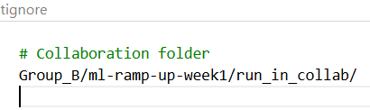

# Learning Notes

## Issues / Blockers
1. Didn't give much effort of the task given (Should've read it and did it with more effort)
2. Overdepended on my team. I thought they would add more stuff as in turn I shared my PPT, I should've done the work by my own thoroughly
3. I dissapointed Mr. Tanveer again, I will give a working one immediately. 
4. Small dataset size (n=150) can cause higher variance across 

## Learnings
1. Redo when It's not working, and document even if it feels redundant.
2. Keep listening for feedback. Even if it's making you feel down it's making you grow.
3. Cross-validation and stratified splits reduce variance risk for small datasets.
4. Do not do assignments while half-concious. Do it well.
5.  Watch what is gitignored
